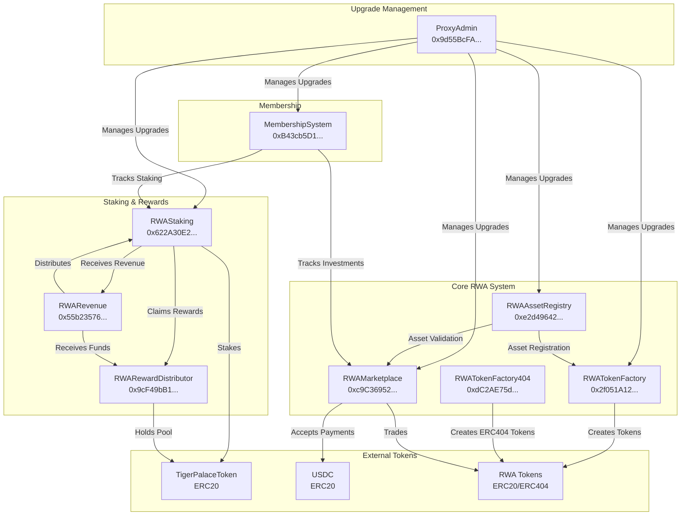
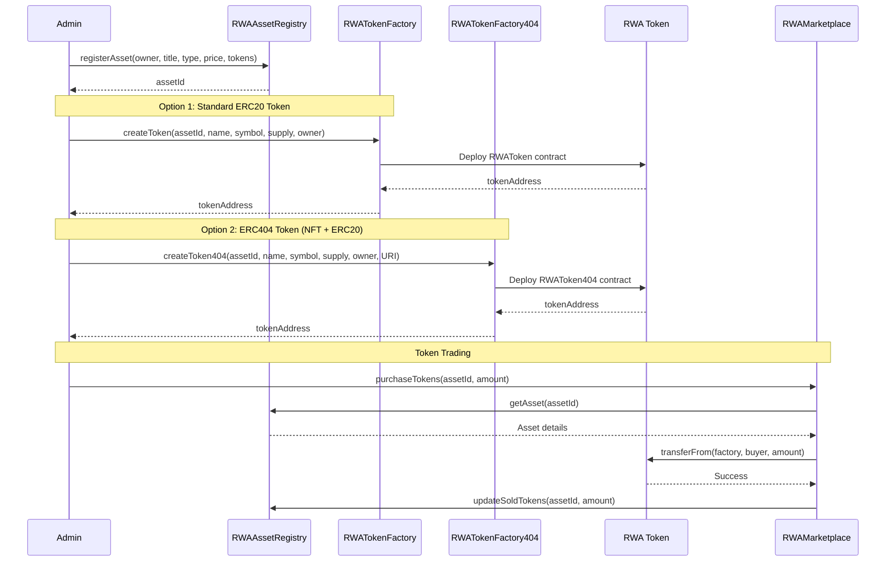
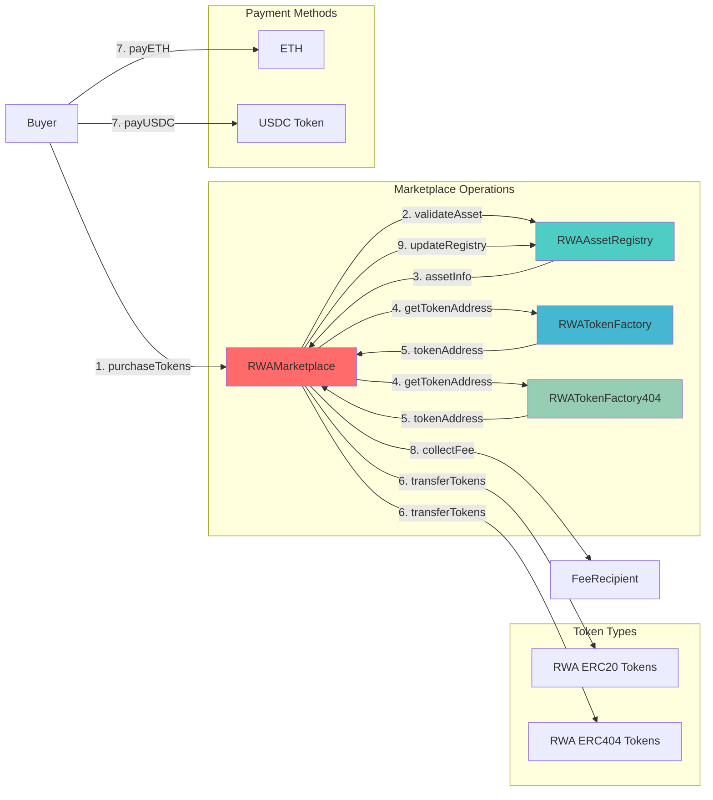
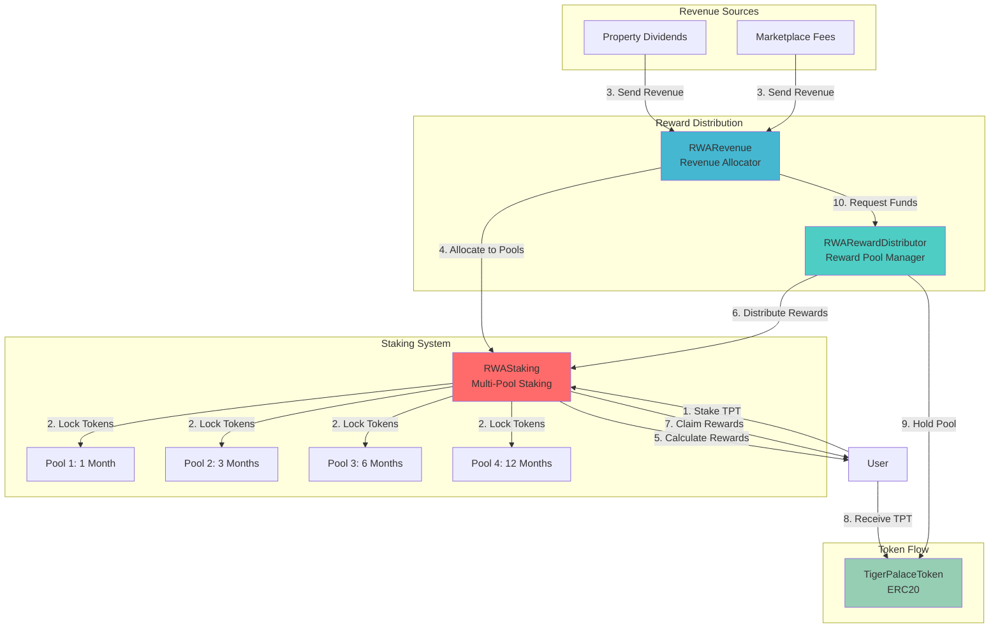
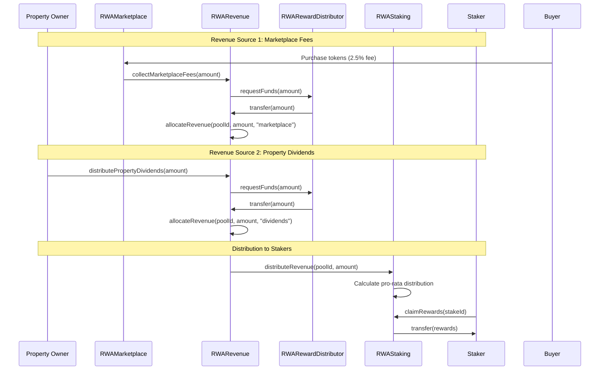
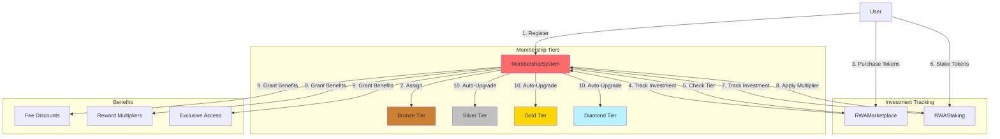
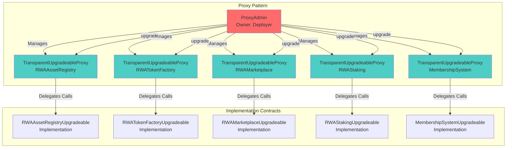

# Tiger Palace Pro - Contract Interaction Architecture

## Overview

This document describes how all deployed contracts interact with each other in the Tiger Palace Pro ecosystem. The system consists of 9 core contracts deployed on Sepolia testnet, managing Real World Asset (RWA) tokenization, trading, staking, rewards, and membership.

## Contract Addresses (Sepolia)

| Contract | Address | Type |
|----------|---------|------|
| ProxyAdmin | `0x9d55BcFA47e88868B54C811041A942250d7F3DD9` | Upgrade Management |
| RWAAssetRegistry | `0xe2d49642B5aE5D0f62dA79D572d04cA95dB2853D` | Upgradeable Proxy |
| RWATokenFactory | `0x2f051A127Ab4B8b0D78aB5758E06a808a8445566` | Upgradeable Proxy |
| RWATokenFactory404 | `0xdC2AE75dC0D14E2f450156bE83c1F71920b6a896` | Direct Contract |
| RWAMarketplace | `0xc9C369525DFf385935dfDC6aC2F678C26998D0d7` | Upgradeable Proxy |
| RWAStaking | `0x622A30E2da7A9F4f5Af7ad76008FBC18F848A1cc` | Upgradeable Proxy |
| RWARewardDistributor | `0x9cF49bB1D64c8D40c693FcAA9d326950b5F29EaB` | Direct Contract |
| RWARevenue | `0x55b23576e535504F6db282159CD082bD97e16989` | Direct Contract |
| MembershipSystem | `0xB43cb5D178D8361307950da607D4A58C78aE8473` | Upgradeable Proxy |

---

## System Architecture Overview



---

## RWA Tokenization Flow



---

## Marketplace Trading Flow



---

## Staking & Rewards Ecosystem



---

## Revenue Distribution Flow



---

## Membership System Integration



---

## Upgradeable Proxy Architecture



---

## Role-Based Access Control

```mermaid
graph TB
    subgraph "RWAAssetRegistry Roles"
        AR[RWAAssetRegistry]
        AR_ADMIN[DEFAULT_ADMIN_ROLE]
        AR_ASSET[ASSET_MANAGER_ROLE]
        AR_MARKET[MARKETPLACE_ROLE]
    end
    
    subgraph "RWATokenFactory Roles"
        TF[RWATokenFactory]
        TF_ADMIN[DEFAULT_ADMIN_ROLE]
        TF_CREATOR[TOKEN_CREATOR_ROLE]
    end
    
    subgraph "RWAMarketplace Roles"
        MP[RWAMarketplace]
        MP_ADMIN[DEFAULT_ADMIN_ROLE]
        MP_MARKET[MARKETPLACE_ADMIN_ROLE]
        MP_FEE[FEE_MANAGER_ROLE]
    end
    
    subgraph "RWAStaking Roles"
        ST[RWAStaking]
        ST_ADMIN[DEFAULT_ADMIN_ROLE]
        ST_POOL[POOL_MANAGER_ROLE]
        ST_REWARD[REWARD_MANAGER_ROLE]
    end
    
    subgraph "RWARevenue Roles"
        RV[RWARevenue]
        RV_ADMIN[DEFAULT_ADMIN_ROLE]
        RV_REVENUE[REVENUE_MANAGER_ROLE]
        RV_DIST[DISTRIBUTOR_ROLE]
    end
    
    subgraph "RWARewardDistributor Roles"
        RD[RWARewardDistributor]
        RD_ADMIN[DEFAULT_ADMIN_ROLE]
        RD_REWARD[REWARD_MANAGER_ROLE]
        RD_COLLECT[REVENUE_COLLECTOR_ROLE]
    end
    
    subgraph "MembershipSystem Roles"
        MS[MembershipSystem]
        MS_ADMIN[DEFAULT_ADMIN_ROLE]
        MS_MEMBER[MEMBERSHIP_MANAGER_ROLE]
        MS_BENEFIT[BENEFIT_MANAGER_ROLE]
    end
    
    AR_ADMIN -->|Grants| AR_ASSET
    AR_ADMIN -->|Grants| AR_MARKET
    MP -->|Has| AR_MARKET
    
    TF_ADMIN -->|Grants| TF_CREATOR
    MP -->|Has| TF_CREATOR
    
    MP_ADMIN -->|Grants| MP_MARKET
    MP_ADMIN -->|Grants| MP_FEE
    
    ST_ADMIN -->|Grants| ST_POOL
    ST_ADMIN -->|Grants| ST_REWARD
    
    RV_ADMIN -->|Grants| RV_REVENUE
    RV_ADMIN -->|Grants| RV_DIST
    
    RD_ADMIN -->|Grants| RD_REWARD
    RD_ADMIN -->|Grants| RD_COLLECT
    
    MS_ADMIN -->|Grants| MS_MEMBER
    MS_ADMIN -->|Grants| MS_BENEFIT
```



---

## Complete Interaction Matrix

| From Contract | To Contract | Interaction Type | Purpose |
|--------------|-------------|----------------|---------|
| **RWAMarketplace** | RWAAssetRegistry | Read | Validate asset exists and get asset details |
| **RWAMarketplace** | RWATokenFactory | Read | Get token address for asset |
| **RWAMarketplace** | RWATokenFactory404 | Read | Get ERC404 token address for asset |
| **RWAMarketplace** | RWA Tokens | Write | Transfer tokens to buyers |
| **RWAMarketplace** | RWAAssetRegistry | Write | Update sold tokens count |
| **RWAMarketplace** | RWARevenue | Write | Send marketplace fees |
| **RWATokenFactory** | RWA Tokens | Write | Create, mint, burn tokens |
| **RWATokenFactory404** | RWA Tokens (404) | Write | Create, mint, burn ERC404 tokens |
| **RWAStaking** | TigerPalaceToken | Read/Write | Stake and unstake tokens |
| **RWAStaking** | RWARevenue | Read | Get revenue allocation data |
| **RWAStaking** | RWARewardDistributor | Read/Write | Request and receive rewards |
| **RWARevenue** | RWAStaking | Write | Distribute revenue to stakers |
| **RWARevenue** | RWARewardDistributor | Read/Write | Request funds for distribution |
| **RWARevenue** | TigerPalaceToken | Read/Write | Transfer tokens to staking contract |
| **RWARewardDistributor** | TigerPalaceToken | Read/Write | Hold and distribute reward pool |
| **RWARewardDistributor** | RWAStaking | Write | Distribute rewards |
| **RWARewardDistributor** | RWARevenue | Write | Provide funds for revenue distribution |
| **MembershipSystem** | RWAMarketplace | Read | Track user investments |
| **MembershipSystem** | RWAStaking | Read | Track user staking activity |
| **ProxyAdmin** | All Proxies | Write | Upgrade implementation contracts |

---

## Key Interaction Patterns

### 1. Asset Tokenization Pattern
```
Admin → RWAAssetRegistry.registerAsset()
     → RWATokenFactory.createToken() OR RWATokenFactory404.createToken404()
     → RWA Token Contract Deployed
     → Token Address Stored in Factory
```

### 2. Token Purchase Pattern
```
Buyer → RWAMarketplace.purchaseTokens()
     → RWAAssetRegistry.getAsset() [READ]
     → RWATokenFactory.getTokenAddress() [READ]
     → RWA Token.transferFrom() [WRITE]
     → RWAAssetRegistry.updateSoldTokens() [WRITE]
     → RWARevenue.collectMarketplaceFees() [WRITE]
```

### 3. Staking Pattern
```
User → RWAStaking.stake()
     → TigerPalaceToken.transferFrom() [WRITE]
     → Stake Record Created
     → Rewards Calculated Based on Pool Duration
```

### 4. Reward Claim Pattern
```
User → RWAStaking.claimRewards()
     → RWAStaking.calculateRewards()
     → RWARewardDistributor.distributeRewards() [WRITE]
     → TigerPalaceToken.transfer() [WRITE]
```

### 5. Revenue Distribution Pattern
```
Revenue Source → RWARevenue.allocateRevenue()
              → RWARevenue.distributeRevenue()
              → RWAStaking.distributeRevenue()
              → Pro-rata Distribution to Stakers
```

### 6. Membership Upgrade Pattern
```
User Activity → MembershipSystem.updateInvestment()
            → MembershipSystem.checkTierRequirements()
            → MembershipSystem.upgradeMembership()
            → Benefits Applied to Marketplace/Staking
```

---

## Security Considerations

### Access Control
- All contracts use OpenZeppelin's `AccessControl` for role-based permissions
- Critical functions are protected by role checks
- Marketplace has `MARKETPLACE_ROLE` on Registry to update token counts
- Factory has `TOKEN_CREATOR_ROLE` to create tokens

### Upgrade Safety
- ProxyAdmin controls all upgrades
- Implementation contracts are separate from proxies
- Storage layout must be preserved during upgrades
- Upgrade functions are protected by admin role

### Reentrancy Protection
- All contracts use `ReentrancyGuard` for critical functions
- Marketplace, Staking, Revenue, and RewardDistributor are protected
- Checks-Effects-Interactions pattern followed

### Pausability
- All contracts implement `Pausable` for emergency stops
- Admin can pause contracts in case of vulnerabilities
- Critical operations check `whenNotPaused` modifier

---

## Contract Dependencies

### Direct Dependencies
- **RWAMarketplace** depends on:
  - `RWAAssetRegistry` (immutable)
  - `RWATokenFactory` (immutable)
  - `RWARevenue` (for fee collection)

- **RWAStaking** depends on:
  - `TigerPalaceToken` (immutable)
  - `RWARevenue` (immutable)
  - `RWARewardDistributor` (immutable)

- **RWARevenue** depends on:
  - `TigerPalaceToken` (immutable)
  - `RWARewardDistributor` (immutable)
  - `RWAStaking` (set via initialize)

- **RWARewardDistributor** depends on:
  - `TigerPalaceToken` (immutable)
  - `RWAStaking` (set via initialize)
  - `RWARevenue` (set via initialize)

### Circular Dependencies (Resolved)
- **RWAStaking** ↔ **RWARevenue**: Both reference each other, initialized separately
- **RWARevenue** ↔ **RWARewardDistributor**: Both reference each other, initialized separately

---

## Deployment Order

1. **ProxyAdmin** - Deployed first (no dependencies)
2. **RWAAssetRegistry** - Deployed as upgradeable proxy
3. **RWATokenFactory** - Deployed as upgradeable proxy
4. **RWATokenFactory404** - Deployed as direct contract (non-upgradeable)
5. **RWAMarketplace** - Deployed as upgradeable proxy (depends on Registry + Factory)
6. **RWARewardDistributor** - Deployed as direct contract (depends on TigerPalaceToken)
7. **RWARevenue** - Deployed as direct contract (depends on TigerPalaceToken + Distributor)
8. **RWAStaking** - Deployed as upgradeable proxy (depends on Token + Revenue + Distributor)
9. **MembershipSystem** - Deployed as upgradeable proxy (no dependencies)

### Post-Deployment Wiring
- Grant `MARKETPLACE_ROLE` to Marketplace on Registry
- Grant `TOKEN_CREATOR_ROLE` to Marketplace on Factory
- Initialize RWARevenue with RWAStaking address
- Initialize RWARewardDistributor with Staking + Revenue addresses
- Initialize RWAStaking with Revenue + Distributor addresses

---

## Etherscan Links

- [ProxyAdmin](https://sepolia.etherscan.io/address/0x9d55BcFA47e88868B54C811041A942250d7F3DD9)
- [RWAAssetRegistry](https://sepolia.etherscan.io/address/0xe2d49642B5aE5D0f62dA79D572d04cA95dB2853D)
- [RWATokenFactory](https://sepolia.etherscan.io/address/0x2f051A127Ab4B8b0D78aB5758E06a808a8445566)
- [RWATokenFactory404](https://sepolia.etherscan.io/address/0xdC2AE75dC0D14E2f450156bE83c1F71920b6a896)
- [RWAMarketplace](https://sepolia.etherscan.io/address/0xc9C369525DFf385935dfDC6aC2F678C26998D0d7)
- [RWAStaking](https://sepolia.etherscan.io/address/0x622A30E2da7A9F4f5Af7ad76008FBC18F848A1cc)
- [RWARewardDistributor](https://sepolia.etherscan.io/address/0x9cF49bB1D64c8D40c693FcAA9d326950b5F29EaB)
- [RWARevenue](https://sepolia.etherscan.io/address/0x55b23576e535504F6db282159CD082bD97e16989)
- [MembershipSystem](https://sepolia.etherscan.io/address/0xB43cb5D178D8361307950da607D4A58C78aE8473)

---

## Summary

The Tiger Palace Pro contract ecosystem is designed as a modular, upgradeable system for Real World Asset tokenization and trading. Key features:

- **Modularity**: Each contract has a specific purpose and can be upgraded independently
- **Security**: Role-based access control, reentrancy protection, and pausability
- **Flexibility**: Support for both ERC20 and ERC404 token standards
- **Integration**: Contracts work together seamlessly for tokenization, trading, staking, and rewards
- **Upgradeability**: Core contracts use proxy pattern for future improvements
- **Membership**: Tiered membership system with investment-based upgrades

All contracts are deployed and verified on Sepolia testnet, ready for integration with the frontend application.

