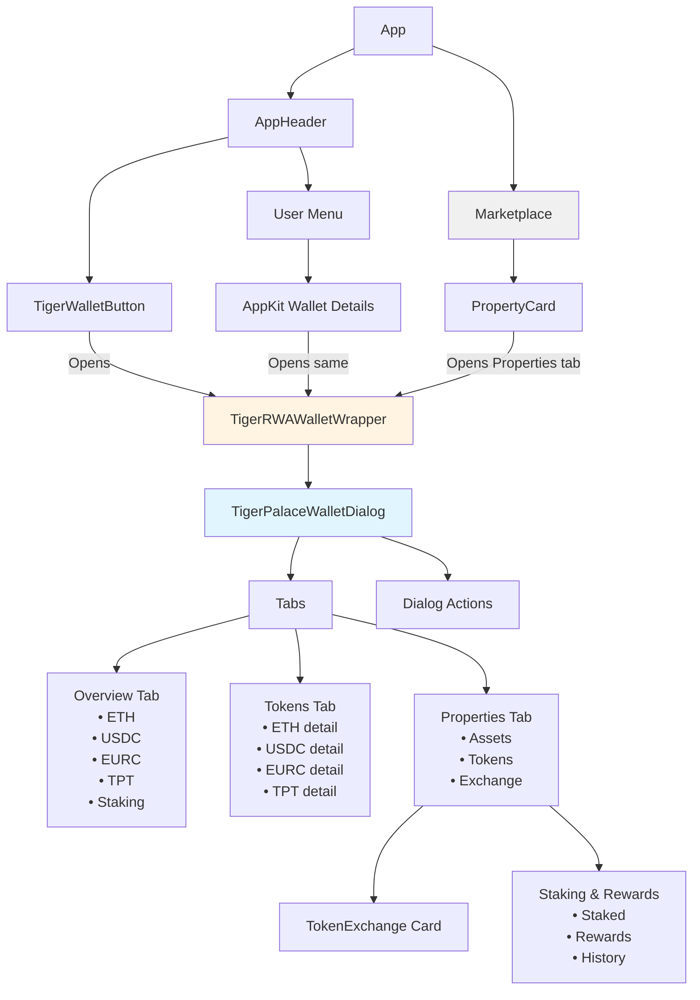
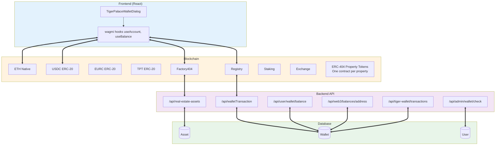

# Contract Release and Tiger Wallet Integration

## Overview

This document provides architecture diagrams and integration details for the Tiger Palace Pro contract deployment and Tiger Wallet integration.

**Release Date**: 2025-01-11  
**Network**: Sepolia Testnet (Chain ID: 11155111)  
**Status**: ✅ Contracts Deployed and Verified

---

## Architecture Diagrams

### Tiger Wallet Component Flow

The following diagram shows how users interact with the Tiger Wallet through the application:

### System Architecture

The following diagram shows the complete system architecture including frontend, blockchain, backend APIs, and database:

---

## Deployed Contracts

### Core Contracts (Sepolia Testnet)

| Contract | Proxy Address | Implementation | Status |
|----------|--------------|----------------|--------|
| **RWAAssetRegistry** | `0xe2d49642B5aE5D0f62dA79D572d04cA95dB2853D` | `0x9e2eD8f46fEb7f70158f1201C06944B724e83411` | ✅ Verified |
| **RWATokenFactory** | `0x2f051A127Ab4B8b0D78aB5758E06a808a8445566` | `0x8239db9a077397a6CE0482A4B4bbf21f00D0815A` | ✅ Verified |
| **RWATokenFactory404** | `0xdC2AE75dC0D14E2f450156bE83c1F71920b6a896` | N/A (Direct) | ✅ Verified |
| **RWAMarketplace** | `0xc9C369525DFf385935dfDC6aC2F678C26998D0d7` | `0x3E8b80714196ecB6925150347215bDF4C1420a8d` | ✅ Verified |
| **RWAStaking** | `0x622A30E2da7A9F4f5Af7ad76008FBC18F848A1cc` | `0x4547421b68B6d8071A924F079f19EE9BA3C0d33D` | ✅ Verified |
| **RWARewardDistributor** | `0x9cF49bB1D64c8D40c693FcAA9d326950b5F29EaB` | N/A (Direct) | ✅ Verified |
| **RWARevenue** | `0x55b23576e535504F6db282159CD082bD97e16989` | N/A (Direct) | ✅ Verified |
| **MembershipSystem** | `0xB43cb5D178D8361307950da607D4A58C78aE8473` | `0x7dE5CcEfcfEa8fA59262a6899d81f01cc69C5949` | ✅ Verified |

### Token Contracts

| Token | Address | Type | Status |
|-------|---------|------|--------|
| **TigerPalaceToken (TPT)** | `0xb0af8e94C74c2346609c3d94FCba61Ae85cf3e6e` | Proxy (UUPS) | ✅ Verified |
| **USDC** | `0x1c7D4B196Cb0C7B01d743Fbc6116a902379C7238` | ERC-20 | ✅ Verified |
| **EURC** | `0x08210F9170F89Ab7658F0B5E3fF39b0E03C594D4` | ERC-20 | ✅ Verified |

### Proxy Admin

**Address**: `0x9d55BcFA47e88868B54C811041A942250d7F3DD9`  
**Purpose**: Manages all upgradeable proxy contracts

---

## Integration Points

### Frontend Components

1. **TigerWalletButton** - Entry point in app header
2. **TigerRWAWalletWrapper** - Wrapper component managing wallet state
3. **TigerPalaceWalletDialog** - Main wallet dialog with tabs
4. **PropertyCard** - Marketplace property cards that open wallet

### Backend APIs

- `/api/tiger-wallet/balances` - Fetch wallet balances (ETH, USDC, EURC, TPT)
- `/api/tiger-wallet/transactions` - Get transaction history
- `/api/real-estate-assets` - Asset data from database
- `/api/walletTransaction` - Wallet transaction records

### Blockchain Integration

- **wagmi** hooks for wallet connection and balance queries
- Direct contract calls for token operations
- Event listening for transaction updates

---

## Component Flow Explanation

### User Journey

1. **Entry Points**:
   - User clicks `TigerWalletButton` in header
   - User opens wallet from `UserMenu` → `AppKitWallet`
   - User clicks property card in marketplace

2. **Wallet Dialog**:
   - Opens `TigerPalaceWalletDialog` via `TigerRWAWrapper`
   - Shows three tabs: Overview, Tokens, Properties
   - Displays balances, transaction history, and property tokens

3. **Interactions**:
   - View balances across all tokens
   - Exchange TPT for property tokens
   - View staking rewards and history
   - Manage property token holdings

---

## System Architecture Explanation

### Frontend Layer
- React components using wagmi for blockchain interactions
- Dialog-based UI for wallet management
- Tab-based navigation for different views

### Blockchain Layer
- Native ETH and ERC-20 tokens (USDC, EURC, TPT)
- Registry and Factory contracts for asset management
- ERC-404 property tokens (one per property)
- Staking and exchange contracts

### Backend Layer
- RESTful APIs for database operations
- Wallet transaction tracking
- Asset metadata management
- User wallet verification

### Database Layer
- Asset records (RealEstateAsset model)
- Wallet transaction history
- User accounts and authentication

---

## Related Documentation

- [Tiger Wallet Integration Summary](../docs/TIGER_WALLET_INTEGRATION_SUMMARY.md)
- [Sepolia Contract Reference](./SEPOLIA_CONTRACT_REFERENCE.md)
- [Marketplace Configuration](./MARKETPLACE_CONFIGURATION_COMPLETE.md)
- [Registry TPT Configuration](./REGISTRY_TPT_CONFIGURATION.md)

---

## Release Checklist

- [x] All contracts deployed to Sepolia
- [x] All contracts verified on Etherscan
- [x] Frontend environment variables configured
- [x] Tiger Wallet components integrated
- [x] API endpoints functional
- [x] Database models aligned with contracts
- [ ] End-to-end testing completed
- [ ] Production deployment ready

---

**Last Updated**: 2025-01-11

