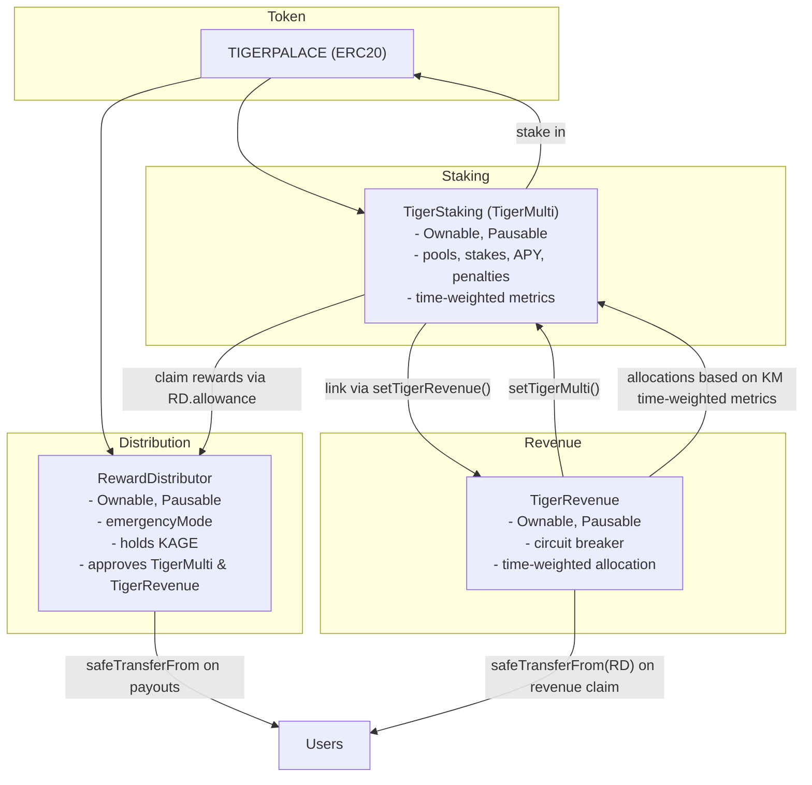
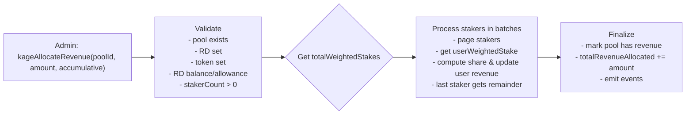

## KAGE Staking System — Architecture, Logic, Configuration, and Operations

This document describes the KAGE staking ecosystem contracts, their relationships, configuration constants, operations, and administrative controls. It also includes a concise Runbook for day‑to‑day operation and incident response.

- **Core contracts**

  - `TigerStaking` (a.k.a. “TigerMulti”): staking pools, user stakes, APY rewards, tiered multipliers, penalty rules, and time‑weighted metrics for revenue allocation.
  - `TigerRevenue`: time‑weighted revenue allocation and claim accounting; circuit breaker and validation layer; integrates with `TigerStaking` and pulls funds from `RewardDistributor`.
  - `RewardDistributor`: custody of reward token; manages allowances, batch approvals, emergency controls; sole source of tokens for staking rewards and revenue payouts.
  - `TIGERPALACE`: ERC‑20 token used for staking and rewards.

- **Key interfaces**
  - `IKageFlexi`: staking views used by `TigerRevenue`.
  - `ITigerRevenue`: allocation/claim surface used by `TigerStaking`.

### System relationships



## Staking pools model and constants

- **Pool configuration** (`TigerStaking.PoolInfo`)

  - `minStaked` (uint128): minimum per stake
  - `apy` (uint64): base APY in basis points (10000 = 100%)
  - `pRate` (uint64): penalty rate in basis points (for early withdrawal)
  - `isActive` (bool)
  - `totalStaked` (uint128)

- **Default pool on initialize(true)**

  - `minStaked = 100 KAGE`, `apy = 10%` (1000 bps), `pRate = 30%`, active.
  - Cap is implicitly unlimited (legacy getter returns `cap = 0`).

- **Tier configuration** (`TierConfig`)

  - `duration` (uint128): threshold in seconds
  - `multBP` (uint256): reward multiplier in basis points (10000 = 1.0x)
  - `pRate` (uint128): compatibility field; reward calc relies on `multBP`
  - `isPenalty` (bool): when true at index 0, defines the penalty window

- **Key constants**
  - `ONE_YEAR_IN_SECONDS = 365 days`
  - `HUNDRED_PERCENT = 10000` (basis points)
  - `MAX_STAKES_PER_USER_PER_POOL = 100`

Important: penalty enforcement depends on `tierConfigs[0]`. Early‑withdrawal penalty and partial‑withdrawal restriction apply only if there is a tier at index 0 with `isPenalty = true`, and the penalty window is defined by that tier’s `duration`.

## Stake structure and accounting

- Users can open many individual stakes per pool: `UserStake { amount, stakeTime, lastRewardTime, rewards, poolId, isActive }`.
- Per‑user‑per‑pool `PoolTracker` tracks `stakes[]`, `totalStaked`, `activeStakeCount`, `totalRewardsClaimed`.
- Global staking lists are kept per pool for time‑weighted calculations and pagination.

## Reward accrual and payouts

- **APY reward accrual per stake**

  - Updates on claim/withdraw:
    - Let `A` = stake amount
    - `t` = time since last reward update
    - `APYbp` = pool APY in basis points
    - `Mbp` = tier multiplier in basis points (based on stake age)
    - Rewards:
      \( rewards = \left\lfloor \dfrac{A \times APY*{bp} \times t \times M*{bp}}{(365\,days) \times 10000 \times 10000} \right\rfloor \)

- **Claiming staking APY**

  - `kageClaimIndividualStakeRewards(poolId, stakeIndex)` transfers from `RewardDistributor` to user via `safeTransferFrom(kageRewardDistributor, user, rewardAmount)`.
  - Requires `RewardDistributor` to hold KAGE and approve `TigerStaking` sufficiently.

- **Withdrawing stake**
  - `userWithdraw(poolId, stakeIndex, amount)`:
    - Recomputes rewards; enforces penalty policy.
    - Partial withdrawal during penalty window reverts (`PartialInPenalty`).
    - Applies penalty to principal: `(withdrawnAmount * pool.pRate) / 10000` to `treasury`.
    - Transfers net principal to user and rewards via `RewardDistributor`.

```mermaid
sequenceDiagram
  autonumber
  actor U as User
  participant KM as TigerStaking
  participant RD as RewardDistributor
  participant K as TIGERPALACE (token)
  participant T as Treasury

  U->>KM:.stake(poolId, amount)
  KM->>K: safeTransferFrom(U, KM, amount)
  note over KM: stake recorded; trackers updated

  U->>KM: kageClaimIndividualStakeRewards(poolId, stakeIndex)
  KM->>KM: compute rewards (APY × time × tier multiplier)
  KM->>RD: safeTransferFrom(RD, U, rewardAmount)

  U->>KM: userWithdraw(poolId, stakeIndex, amount)
  KM->>KM: update rewards; enforce penalty rules
  alt in penalty and partial
    KM-->>U: revert PartialInPenalty
  else proceed
    KM->>T: penalty (if any)
    KM->>K: safeTransfer(U, net principal)
    KM->>RD: safeTransferFrom(RD, U, rewardAmount)
  end
```

## Time‑weighted stakes for revenue distribution

- `TigerStaking` exposes time‑weighted metrics used by `TigerRevenue`:

  - `kageGetTotalWeightedStakes(poolId, now)`: sum of `amount × duration` across stakers (bounded to ≤ 1000 stakers per call; duration capped to ≤ 1 year; scaling and overflow guards).
  - `kageGetUserWeightedStake(user, poolId, now)`: per‑user sum across active stakes (≤ 100 stakes per user per call).

- `TigerRevenue.kageAllocateRevenue(poolId, amount, accumulative)`:
  - Validates pool existence, `RewardDistributor` and token presence, RD balance and allowance, and nonzero stakerCount.
  - Paginates stakers with `kageGetStakersPaginated`, determines each user’s weighted stake, and allocates user revenue:
    \( userRevenue = \left\lfloor \dfrac{amount \times userWeightedStake}{totalWeightedStakes} \right\rfloor \)
  - Updates `kageRevenueData[user][pool]` and aggregates totals; detailed events emitted.



- Users claim revenue via either:
  - `TigerRevenue.kageClaimRevenue(poolId)` (direct), or
  - `TigerStaking.kageClaimRevenue(poolId)` which delegates to `TigerRevenue.kageClaimRevenueForUser`.

Linking requirements:

- `TigerRevenue.setTigerMulti(<TigerStaking proxy>)`
- `TigerStaking.setTigerRevenue(<TigerRevenue proxy>)`

## Operational requirements and guardrails

- **Mandatory initial wiring**

  - `TigerStaking.initialize(kageToken, rewardDistributor, treasury, kageRevenue, createDefaultPool=true)`
  - `TigerRevenue.__TigerRevenue_init(kageMulti = TigerStaking, treasury)` or `setTigerMulti`.
  - `TigerStaking.setTigerRevenue(kageRevenue)`.

- **Funding and allowances**

  - Fund `RewardDistributor` with KAGE sufficient for APY and revenue payouts.
  - Approve allowances from `RewardDistributor`:
    - To `TigerStaking` (APY reward claims)
    - To `TigerRevenue` (revenue claims)
  - Use `approveERC20`, `batchApproveERC20`, and `refreshAllowanceIfNeeded`.

- **Penalty configuration (critical)**

  - Create penalty tier at index 0 to enable early‑withdrawal policy:
    - `addTierConfig(duration = PENALTY_WINDOW_SEC, multBP = 10000, isPenalty = true)`

- **Staking limits**

  - `MAX_STAKES_PER_USER_PER_POOL = 100`
  - `minStaked` enforced per pool
  - Pools are “always open” by default (no join windows)

- **Paused and emergency states**

  - `TigerStaking`: `kagePause()` / `kageUnpause()`
  - `TigerRevenue`: `setEmergencyMode(true)` (auto‑pause), circuit breaker may also pause on anomalies; `setCircuitBreakerThreshold`, `kageEnableRelaxedMode`, `resetCircuitBreaker()`
  - `RewardDistributor`: `enableEmergencyMode()`/`disableEmergencyMode()` for emergency transfers and to block arbitrary execution

- **Circuit breaker in TigerRevenue**
  - Suspicious events increment a counter; if ≥ `circuitBreakerThreshold`, breaker trips and the contract pauses. Relaxed mode raises thresholds and batch size.

## Admin functions (selected)

- `TigerStaking` (owner):

  - Pools: `kageCreatePool`, `updatePool` (compatibility)
  - Treasury/distributor: `kageSetTreasury`, `kageSetRewardDistributor`
  - Revenue link: `setTigerRevenue`, `ownerSetRevenue`
  - Tier management: `addTierConfig`, `kageUpdateTierConfig`
  - Pause/unpause

- `TigerRevenue` (owner):

  - Links: `setTigerMulti`, `setTreasury`
  - Allocation: `kageAllocateRevenue`, `kageEmergencyAllocateRevenue`
  - System: `setEmergencyMode`, `resetCircuitBreaker`, `setMaxBatchSize(≤500)`, `kageEnableRelaxedMode`, `setCircuitBreakerThreshold`
  - Pause/unpause

- `RewardDistributor` (owner):
  - Allowances: `approveERC20`, `batchApproveERC20`, `refreshAllowanceIfNeeded`
  - Funds: `withdrawERC20`, `emergencyTransfer` (emergency mode)
  - Execution: `execTransaction` (blocked in emergency mode)
  - Pause/unpause, `setAllowanceThreshold`

## Frontend‑critical views and getters

- `TigerStaking`:

  - Pools: `kagePoolLength`, `kagePoolInfo(poolId)`, `kagePools(poolId)`
  - Users: `kageGetUserStakesInPool(user, poolId)`, `kageGetUserTotalStaked(user, poolId)`, `kageGetIndividualStakeInfo(user, poolId, stakeIdx)`
  - Tiers: `kageGetTierCount`, `kageGetTierConfig`, `kageGetAllTierConfigs`
  - Metrics: `kageGetTotalWeightedStakes(poolId, now)`, `kageGetUserWeightedStake(user, poolId, now)`, `kageGetPoolStakers(poolId)`

- `TigerRevenue`:

  - Claims: `kageGetPendingRevenue(poolId, user)`, `kageGetRevenueSnapshotTime(poolId, user)`
  - System: `kageGetSystemStatus(poolId)`, `isSystemReadyForOperation(poolId, amount)`

- `RewardDistributor`:
  - Status: `getDetailedStatus(token, spender)`, `getAllowanceStatus(token, spenders[])`, `isSystemReady(token, spender, requiredAmount)`

## Runbook (Operators)

### Initial setup (post‑deployment)

1. Wire references:
   - `TigerRevenue.setTigerMulti(<TigerStaking proxy>)`
   - `TigerStaking.setTigerRevenue(<TigerRevenue proxy>)`
2. Fund `RewardDistributor` with KAGE (e.g., 100k+ KAGE).
3. Approve allowances from `RewardDistributor`:
   - To `TigerStaking` for APY claims (e.g., 1,000,000 KAGE)
   - To `TigerRevenue` for revenue claims (size per allocation policy)
4. Exclude `RewardDistributor` from token fees: `TIGERPALACE.setExcludedFromFee(RD, true)` if needed.
5. Configure penalty tier 0:
   - `addTierConfig(duration = e.g., 30 days, multBP = 10000, isPenalty = true)`
6. Validate system readiness:
   - `TigerRevenue.kageGetSystemStatus(poolId)` and `isSystemReadyForOperation(poolId, amount)`

### Routine operations

- Stake operations happen via .stake(` / `kageStakeInPool` by users.
- Revenue allocation:
  - Call `TigerRevenue.kageAllocateRevenue(poolId, amount, accumulative)`
  - Verify events and status; users claim via app or `kageClaimRevenue`.
- Allowance maintenance:
  - Periodically check RD status: `RewardDistributor.getDetailedStatus(token, spender)`
  - If low, use `RewardDistributor.refreshAllowanceIfNeeded` or `approveERC20`.

### Emergency and incident response

- Stop actions quickly:
  - `TigerStaking.kagePause()` and/or `TigerRevenue.setEmergencyMode(true)` (auto‑pause)
  - `RewardDistributor.enableEmergencyMode()` to block `execTransaction` and allow `emergencyTransfer`
- Circuit breaker trips (in `TigerRevenue`):
  - Investigate validation errors; optionally `kageEnableRelaxedMode(threshold)`
  - After resolution: `resetCircuitBreaker()` and `kageUnpause()` (if not in emergency)
- Liquidity of distributor:
  - Ensure `RewardDistributor` balance and allowances cover pending APY/revenue claims
  - Top‑up KAGE balance and adjust allowances

### Troubleshooting checklist

- Users cannot claim APY or revenue:

  - Check `RewardDistributor` balance and allowance toward the calling contract
  - Verify links: `TigerRevenue.kageMulti()` and `TigerStaking.kageRevenue()`
  - Ensure contracts are not paused or in emergency mode

- Penalties not enforced / partial withdrawals allowed unexpectedly:

  - Ensure `tierConfigs[0]` exists with `isPenalty = true` and a non‑zero `duration`

- Revenue allocation fails or pauses:
  - Review `TigerRevenue` circuit breaker status; increase threshold or enable relaxed mode if appropriate; confirm staker count and weighted stakes

## Notes on compatibility and deprecations

- Several legacy‑named functions are kept for DApp compatibility and should not be removed without a coordinated frontend change (e.g., `kagePoolInfo`, `kageTotalStaked`, tier getters). The DApp relies on direct on‑chain getters.
